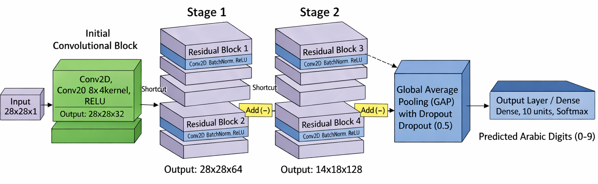
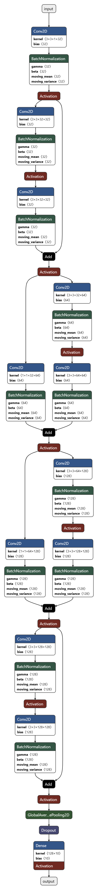

# ResCo-Mini: Arabic Handwritten Digit Recognition 

> **A Novel CNN Architecture employing Residual Connection Networks for Arabic Handwritten Digit Recognition**

Achieving **99.24% accuracy** with only **606K parameters** — 96× smaller than AlexNet while outperforming it!

---

## Abstract

Arabic handwritten digit recognition poses unique challenges in computer vision due to the complexity of Arabic numerals and regional writing style variations. This project introduces **ResCo-Mini** (Residual Compact Mini), a lightweight CNN architecture that combines residual learning with computational efficiency.

**Key Achievements:**
-  **State-of-the-art**: 99.24% test accuracy on AHDD dataset
-  **Efficient**: 96× fewer parameters than AlexNet (606K vs 58.3M)
-  **Fast**: Training in ~5 minutes on single GPU
-  **Balanced**: Optimal trade-off between accuracy and efficiency

---

##  Highlights

| Model | Accuracy | F1-Score | Parameters | Training Time | Efficiency Score* |
|-------|----------|----------|------------|---------------|-------------------|
| LeNet-5 | 98.76% | 0.9876 | 61.7K | 0.6 min | 1600.5 |
| AlexNet | 99.19% | 0.9919 | 58.3M | 11.6 min | 1.7 |
| **ResCo-Mini** | **99.24%** | **0.9924** | **606K** | **4.8 min** | **163.7** |

*Efficiency Score = Accuracy / (Parameters in millions)

---

##  Repository Structure

```
DL_CNN/
├── notebooks/
│   └── DL-Alexnet-Lenet-ResCo-mini-AHDD1    # AlexNet/LeNet-5 implementation + ResCo-Mini (our architecture)
├── models/
│   ├── alexnet_best_model.keras            # Trained AlexNet
│   ├── lenet5_best_model.keras             # Trained LeNet-5
│   └── resco_mini_best_model.keras         # Trained ResCo-Mini
├── results/
│   ├── confusion_matrices/                 # Confusion matrix visualizations
│   ├── training_curves/                    # Training/validation curves
│   └── comparison_charts/                  # Comparative analysis plots
├── paper/
│   └── ResCo-Mini_Paper.pdf               # Full research paper
├── LICENSE                                 # MIT License
└── README.md                              # This file
```

---

##  ResCo-Mini Architecture

### High-Level Overview

```
Input (28×28×1)
    ↓
Initial Conv2D (32 filters) + BatchNorm + ReLU
    ↓
┌─────────────────────────────────────┐
│  Residual Block 1 (32 filters)      │  ← Stage 1: Feature Consolidation
│  Output: 28×28×32                   │
└─────────────────────────────────────┘
    ↓
┌─────────────────────────────────────┐
│  Residual Block 2 (64 filters, ↓2) │  ← Stage 2: Downsampling
│  Output: 14×14×64                   │
└─────────────────────────────────────┘
    ↓
┌─────────────────────────────────────┐
│  Residual Block 3 (128 filters, ↓2)│  ← Stage 3: Deep Features
│  Output: 7×7×128                    │
└─────────────────────────────────────┘
    ↓
┌─────────────────────────────────────┐
│  Residual Block 4 (128 filters)     │  ← Stage 4: Semantic Features
│  Output: 7×7×128                    │
└─────────────────────────────────────┘
    ↓
Global Average Pooling (128)
    ↓
Dropout (0.5)
    ↓
Dense (10 classes) + Softmax
    ↓
Output (Predicted Digit)
```

### Residual Block Structure

```
Input (x)
    ↓
┌───────────────────────────┐
│ Conv2D (3×3)              │
│ BatchNorm + ReLU          │
│         ↓                 │
│ Conv2D (3×3)              │
│ BatchNorm                 │
└───────────────────────────┘
    ↓
   Add (+) ← Skip Connection (x)
    ↓
  ReLU
    ↓
  Output
```

**Key Features:**
-  **Skip Connections**: Enable gradient flow through 18 layers
-  **Batch Normalization**: Stabilize training and act as regularizer
-  **Global Average Pooling**: Replace large FC layers, reduce overfitting
-  **L2 Regularization**: λ=0.0001 on all conv layers

---

##  Quick Start

### 1. Clone Repository

```bash
git clone https://github.com/RuwaYafa/DL_CNN.git
cd DL_CNN
```

### 3. Download Dataset

The [Arabic Handwritten Digits Dataset (AHDD)](https://www.kaggle.com/datasets/mloey1/ahdd1/data) is available on Kaggle:

- Training: 60,000 images (28×28 grayscale)
- Testing: 10,000 images (28×28 grayscale)
- Classes: 10 (٠, ١, ٢, ٣, ٤, ٥, ٦, ٧, ٨, ٩)

### 4. Run Training

**Option A: Kaggle Notebook (Recommended)**
1. Open notebooks on [Kaggle](https://www.kaggle.com/)
2. Add dataset: `mloey1/ahdd1`
3. Enable GPU: Settings → Accelerator → GPU P100
4. Run cells

---

##  Results & Analysis

### Performance Metrics

| Metric | AlexNet | LeNet-5 | ResCo-Mini |
|--------|---------|---------|------------|
| **Test Accuracy** | 99.19% | 98.76% | **99.24%**  |
| **F1-Score (Macro)** | 0.9919 | 0.9876 | **0.9924**  |
| **Parameters** | 58.3M | 61.7K | 606K |
| **Training Time** | 11.6 min | 0.6 min | 4.8 min |
| **Inference (samples/s)** | ~2,300 | ~12,000 | ~8,500 |

### Per-Digit Accuracy

| Digit | AlexNet | LeNet-5 | ResCo-Mini | Winner |
|-------|---------|---------|------------|---------|
| 0 (٠) | 98.0% | 98.0% | **99.2%** | ResCo-Mini |
| 1 (١) | **99.0%** | 98.0% | 98.8% | AlexNet |
| 2 (٢) | 99.0% | 98.0% | **99.6%** | ResCo-Mini |
| 3 (٣) | 99.0% | 99.0% | **99.3%** | ResCo-Mini |
| 4 (٤) | 99.0% | 99.0% | **99.3%** | ResCo-Mini |
| 5 (٥) | 98.0% | 98.0% | **98.5%** | ResCo-Mini |
| 6 (٦) | 99.0% | 99.0% | **99.6%** | ResCo-Mini |
| 7 (٧) | **100.0%** | 99.0% | 99.2% | AlexNet |
| 8 (٨) | **100.0%** | **100.0%** | 99.6% | AlexNet/LeNet |
| 9 (٩) | 99.0% | 99.0% | **99.3%** | ResCo-Mini |

**ResCo-Mini wins on 7 out of 10 digits!** 

### Confusion Analysis

**Most Confused Digit Pairs (ResCo-Mini):**
1. Digit 6 → 8: 4 instances (0.40%)
2. Digit 5 → 8: 3 instances (0.30%)
3. Digit 0 → 5: 2 instances (0.20%)

All errors are below 0.5%, indicating exceptional robustness!

---

##  Research Paper

**Full Paper:** [ResCo-Mini: A Novel CNN Architecture for Arabic Handwritten Digit Recognition](https://www.dropbox.com/scl/fo/b1epsw12p0kgh6eyi54xh/AAfOndNaACHNUJIlnUaDojY?rlkey=d2me0xmfw4bem97fcywu4hd9e&st=0gjsd74j&dl=0)


---

##  Implementation Details

### Training Configuration

**ResCo-Mini:**
- **Optimizer**: Adam (lr=0.001)
- **Loss**: Categorical Cross-Entropy
- **Batch Size**: 128
- **Epochs**: 50 (with early stopping)
- **Regularization**: 
  - L2 Weight Decay (λ=0.0001)
  - Dropout (rate=0.5)
  - Batch Normalization
- **Callbacks**:
  - ReduceLROnPlateau (factor=0.5, patience=7)
  - EarlyStopping (patience=15)
  - ModelCheckpoint (save best weights)

**Hardware:**
- GPU: NVIDIA Tesla P100
- Framework: TensorFlow 2.x + Keras 3.0
- Platform: Kaggle Notebooks

---

##  Key Innovations

### 1. **Skip Connections**
Enable training of 18-layer network without vanishing gradients:
```
F(x) = ReLU(H(x) + W_s·x)
```

### 2. **Global Average Pooling**
Replaces large FC layers (4096→4096 in AlexNet):
- Reduces parameters by ~90%
- Acts as structural regularizer
- Maintains spatial invariance

### 3. **Progressive Downsampling**
Hierarchical feature extraction at multiple scales:
- 28×28 → 14×14 → 7×7
- Doubles channels at each downsampling: 32→64→128

### 4. **Balanced Architecture**
Optimal depth (18 layers) without excessive complexity

---

##  Comparative Analysis

### Architecture Comparison

| Feature | LeNet-5 | AlexNet | ResCo-Mini |
|---------|---------|---------|------------|
| **Year** | 1998 | 2012 | 2024 |
| **Depth** | 7 layers | 8 layers | 18 layers |
| **Skip Connections** | ❌ | ❌ | ✅ |
| **Batch Normalization** | ❌ | ❌ | ✅ |
| **Global Avg Pooling** | ❌ | ❌ | ✅ |
| **Activation** | Tanh | ReLU | ReLU |
| **Pooling** | Average | Max | Global Average |
| **Best For** | Speed | Baseline | Production |

### Efficiency Frontier

```
         High Accuracy
              ↑
              |     ResCo-Mini ⭐
              |        /
              |       /
         99%  |  AlexNet
              |      |
              |      |
         98%  | LeNet-5
              |
              └──────────────────→
            Low Params    High Params
```


